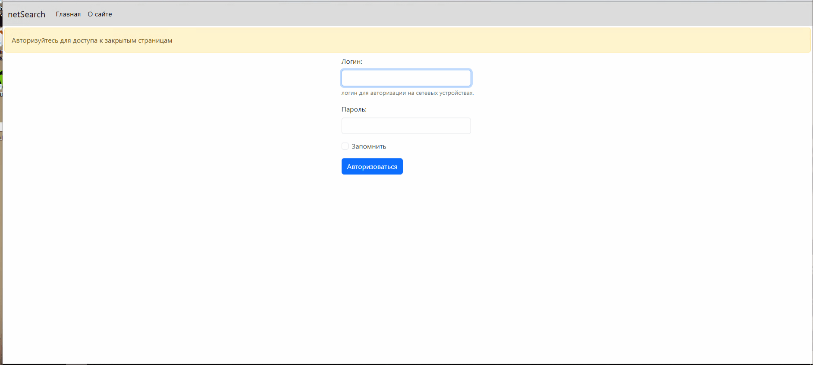

Веб-версия python-приложения, сделанная на Flask, для сбора статистики с сетевых сегментов дата-центров и получения данных о хостах в сетевых сегментах дата-центров.

В статистику выводятся следующие данные:
- VLAN ID
- Описание сетевого сегмента
- Сетевое оборудование дата-центра, где находится данный сегмент сети
- VRF NAME
- SVI
- Количество служебных ip/mac адресов в сети
- Количество ip/mac адресов, занятое хостами сегмента
- Процент использования адресного пространства сети хостами сегмента

По каждому хосту сетевого сегмента выводится следующая информация:
- Имя хоста
- IPv4 адрес хоста
- MAC-адрес хоста
- Вендор хоста

###### Пример работы приложения.

